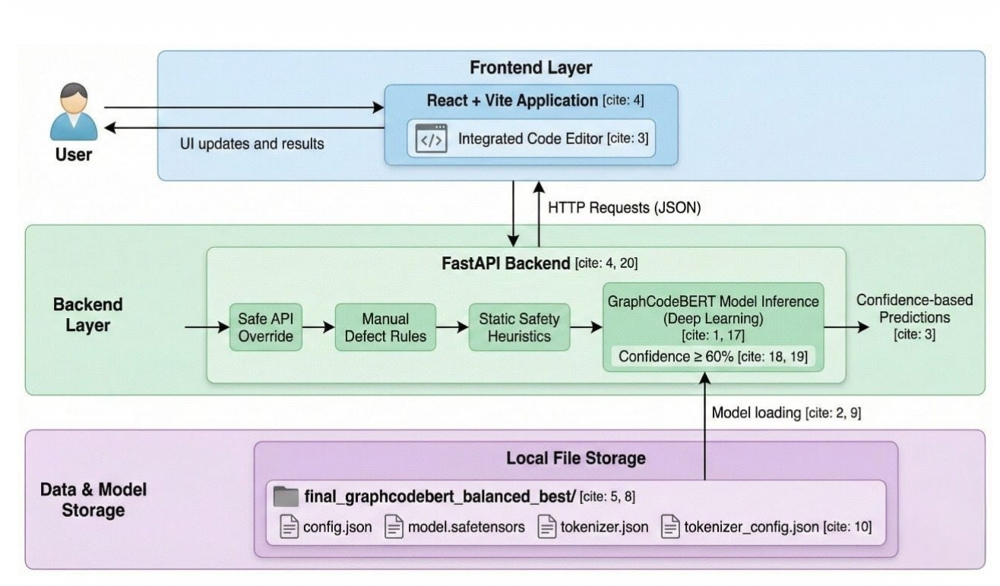
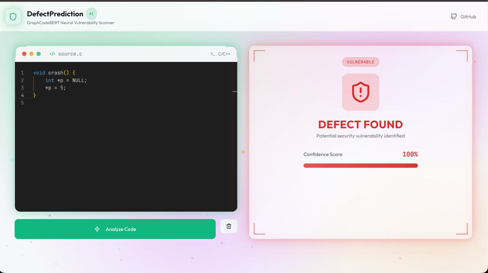

# 🛡️ DefectPrediction
**AI-Powered Vulnerability Detection for C/C++ Code**

DefectPrediction is a full-stack machine learning web application that detects security vulnerabilities in C/C++ source code.
It combines **manual safety rules**, **static heuristics**, and **deep learning inference** using a fine-tuned **GraphCodeBERT** model to reduce false positives and improve reliability.

## 🧠 Architecture Overview

<p align="center">
  
</p>

## 🎨 Application Interface

<p align="center">
  
</p>

---

## 🚀 Features

- 🔍 Detects common vulnerabilities:
  - Buffer overflows
  - Null pointer dereferences
  - Use-after-free
  - Out-of-bounds access
- 🧠 Fine-tuned **GraphCodeBERT** model
- 🛑 Manual rule-based checker (highest priority)
- 🟢 Structural clean overrides to reduce false positives
- 🌐 Full-stack application:
  - **FastAPI** backend
  - **React + Vite** frontend
- 📊 Confidence-based predictions
- 🎨 Modern UI with integrated code editor

---

## 🧩 Project Structure

```
DefectPrediction/
├── Backend/
│   ├── app.py
│   ├── requirements.txt
│   └── final_graphcodebert_balanced_best/   (download separately)
├── FrontEnd/
│   ├── src/
│   ├── package.json
│   └── vite.config.ts
├── .gitignore
├── README.md
```

---

## 🧠 Model Information

- **Model**: GraphCodeBERT
- **Dataset**: CodeXGLUE Devign
- **Task**: Binary classification (Clean vs Defective)
- **Frameworks**: PyTorch, HuggingFace Transformers

> ⚠️ The trained model is **not included in this repository** due to size constraints.

---

## 📥 Model Download (Required)

### 🔗 Download the trained model from Google Drive
👉 **https://drive.google.com/file/d/1Q3_x5eaYQ-jlntAgGuo9sau5Kic-P5r8/view**

### 📂 Setup Steps

1. Download and extract:
   ```
   final_graphcodebert_balanced_best/
   ```

2. Place it inside:
   ```
   Backend/final_graphcodebert_balanced_best/
   ```

3. Ensure the folder contains:
   - `config.json`
   - `model.safetensors`
   - `tokenizer.json`
   - `tokenizer_config.json`

---

## ⚙️ Backend Setup (FastAPI)

```bash
cd Backend
python -m venv venv
source venv/bin/activate   # macOS / Linux
venv\Scripts\activate    # Windows
pip install -r requirements.txt
uvicorn app:app --reload
```

Backend URL: http://127.0.0.1:8000  
API Docs: http://127.0.0.1:8000/docs

---

## 🎨 Frontend Setup (React + Vite)

```bash
cd FrontEnd
npm install
npm run dev
```

Frontend URL: http://localhost:5173

---

## 🧪 How It Works

```
Safe API Override
    ↓
Manual Defect Rules
    ↓
Static Safety Heuristics
    ↓
GraphCodeBERT Model (60% confidence threshold)
```

---

## 🧠 Decision Strategy

- **Manual rules** override everything (guaranteed defects)
- **Structural clean overrides** suppress ML false positives
- ML inference is used only when rules are inconclusive
- Code is marked defective only if confidence ≥ **60%**

---

## 🛠️ Technologies Used

- **Backend**: FastAPI, PyTorch, HuggingFace Transformers
- **Frontend**: React, Vite, Tailwind CSS
- **Model**: GraphCodeBERT
- **Languages**: Python, TypeScript, C/C++

---

## 📌 Notes

- The system prioritizes **false-negative avoidance**
- Pointer-heavy clean code may still receive low defect confidence
- Rule-based overrides improve real-world usability

---

## 📜 License

This project is intended for **educational and research purposes**.

---

